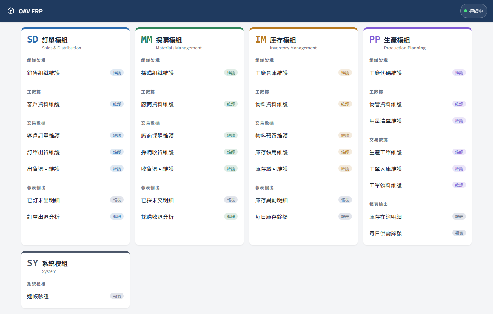
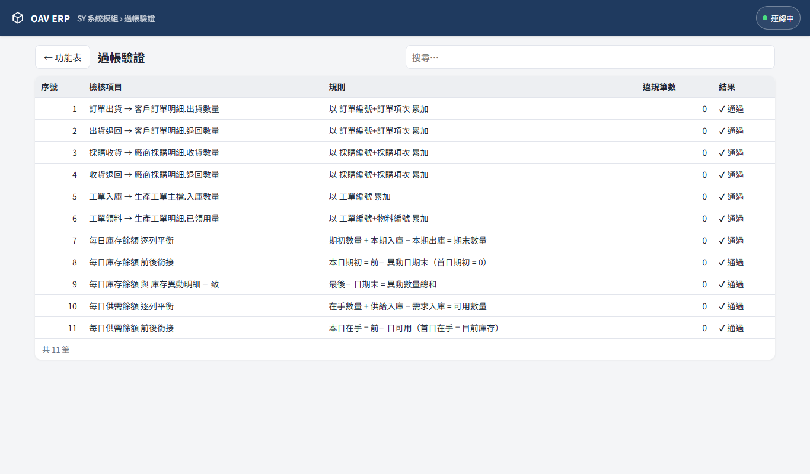
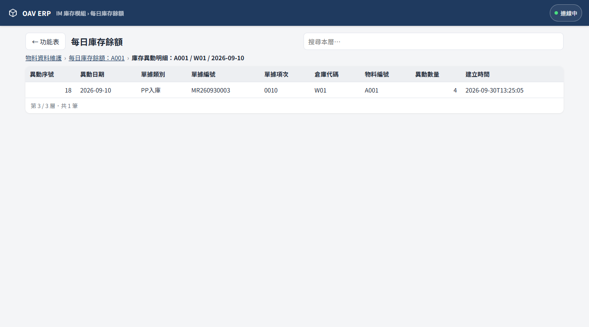
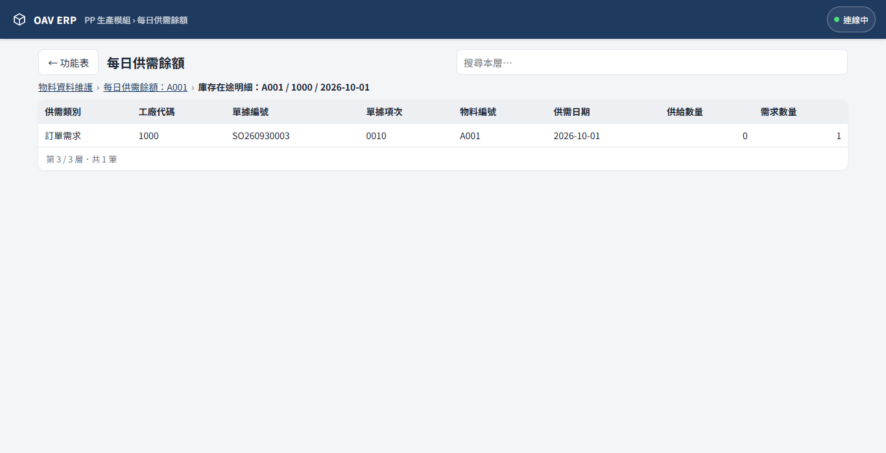
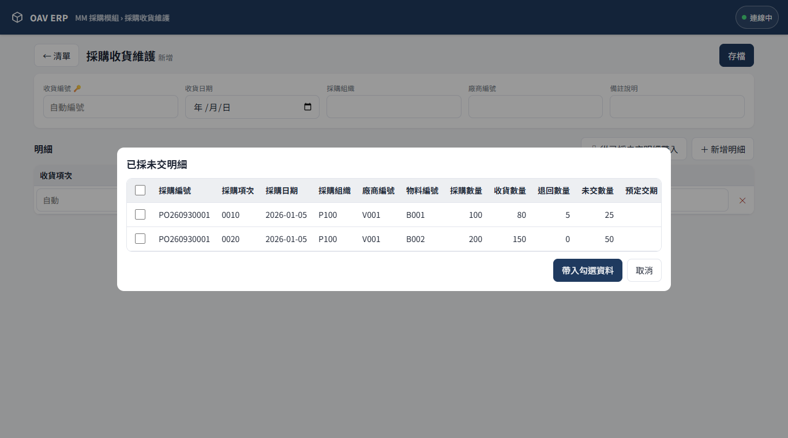
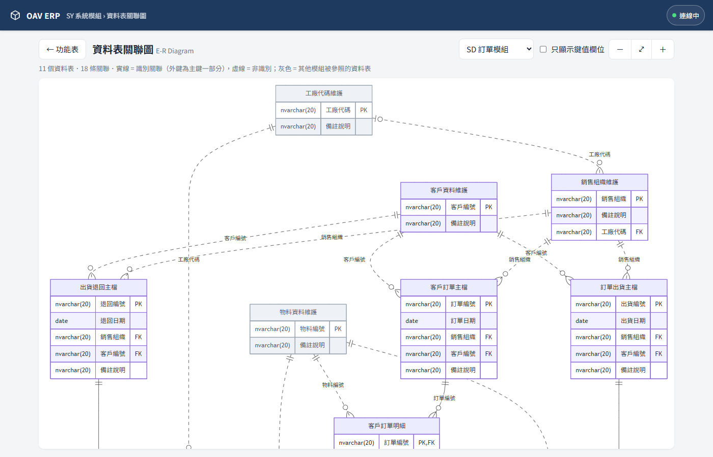
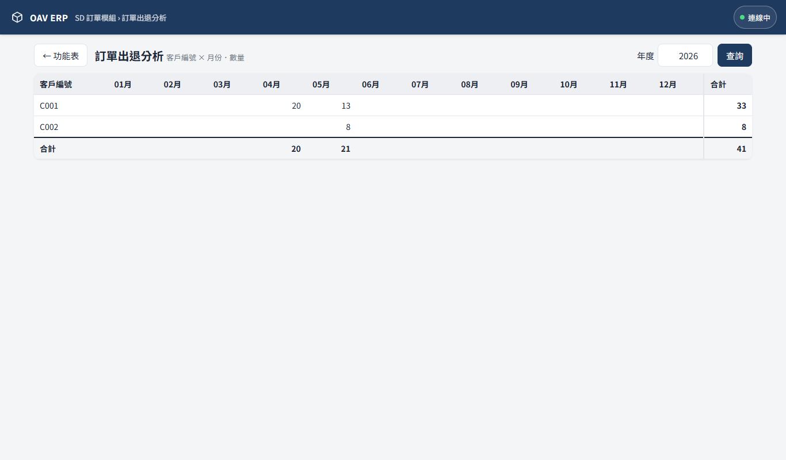
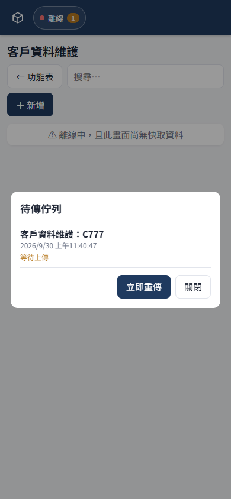

# GemioERP — ERP 庫存管理系統

> 系統名稱：**GemioERP**（GitHub repo `oav_wms`、資料庫 `oav00`、Zeabur 專案 `oav-wms` 為既有內部代號，未改名）

PWA 前端 + 極薄 Node 閘道 + SQL Server。**商業邏輯全部在資料庫**（資料表約束、觸發程序、視圖、預存程序），前端只負責「畫出資料庫給的畫面定義」與「斷線重傳佇列」。

畫面左側為樹狀主功能表（模組 › 群組 › 功能，手機版為 ☰ 抽屜），**首頁即資料表關聯圖**。



## 模組
| 模組 | 組織架構 | 主數據 | 交易數據 | 報表輸出 |
|---|---|---|---|---|
| SD 訂單 | 銷售組織 | 客戶 | 客戶訂單、訂單出貨、出貨退回 | 已訂未出明細、訂單出退分析（樞紐） |
| MM 採購 | 採購組織 | 廠商 | 廠商採購、採購收貨、收貨退回 | 已採未交明細、採購收退分析（樞紐） |
| IM 庫存 | 工廠倉庫 | 物料 | 物料預留、庫存領用、庫存繳回 | 庫存異動明細、每日庫存餘額（三層下鑽） |
| PP 生產 | 工廠代碼 | 物管、用量清單、途程清單、製程、機台 | 生產工單、工單領料、工單回報、工單入庫、工單入庫三階 | 庫存在途明細、每日供需餘額（三層下鑽）、生產工序明細 |
| SY 系統 | | | | 驗証過帳、資料表關聯圖（E-R Diagram） |

## 快速開始
```bash
npm install
cp 設定.example.json 設定.json   # 填入 SQL Server 連線資訊
npm run db:reset                 # 建立資料庫（含範例主數據）
npm start                        # http://localhost:3000
npm test                         # 在獨立的 <資料庫>_test 跑端對端測試（不影響正式資料）
```
`npm run db:deploy` 執行結構遷移（`01_遷移.sql`）並更新觸發程序/視圖/預存程序/功能表，不清除資料。

## 雲端部署（Zeabur）
正式網址：**https://wms.zeabur.app**（Zeabur 專案 `oav-wms`，只跑 Node 閘道；資料庫仍是 `設定.json` 中的 SQL Server）。
- 雲端沒有 `設定.json`，改用環境變數 `DB_SERVER`、`DB_PORT`、`DB_USER`、`DB_PASSWORD`、`DB_NAME`（在 Zeabur 服務的 Variables 設定）。
- 更新版本：先 commit，再用乾淨副本上傳（避免把 `設定.json` 傳上去）：
  ```bash
  git archive HEAD | tar -x -C <暫存目錄> && cd <暫存目錄>
  npx zeabur deploy --service-id 6abd2d1aaa61051740e6eddd --environment-id 6abd2d0a6a5a32a7a9b37fab -i=false
  ```
- 資料庫結構異動仍在本機執行 `npm run db:deploy`。

## 架構
```
手機 / 瀏覽器 (PWA)                Node 閘道 (server.js)               SQL Server
┌──────────────────────┐  POST   ┌──────────────────────┐  EXEC   ┌────────────────────────────┐
│ app.js  依畫面定義繪製 │ ──────▶ │ /api/<程序>          │ ──────▶ │ api.<程序> @JSON, @回應 OUT │
│ outbox.js IndexedDB 佇列│ ◀────── │ 不含任何商業邏輯      │ ◀────── │ 觸發程序 / 視圖 / 約束      │
│ sw.js 離線快取+背景同步 │  JSON   └──────────────────────┘  JSON   └────────────────────────────┘
└──────────────────────┘
```

| 檔案 | 內容 |
|---|---|
| `db/01_資料表.sql` | 全部資料表；PK / FK / CHECK（超出、超收、超領、超退、每日餘額平衡） |
| `db/01_遷移.sql` | 既有資料庫的結構升級（可重複執行） |
| `db/02_觸發程序.sql` | 過帳機制：來源累計量 `= SUM(明細)`、寫入 庫存異動明細、重算 每日庫存餘額 |
| `db/03_視圖.sql` | 已訂未出、已採未交、工單未領用料、出退/收退分析來源、庫存現況、庫存在途明細、每日供需餘額、系統驗證結果 |
| `db/04_系統與API.sql` | 系統資料表 + `api.*` 預存程序（功能表、畫面定義、清單、選單、讀取、存檔、刪除、樞紐、下鑽、參照、關聯圖） |
| `db/05_功能表與設定.sql` | 主功能表、唯讀欄位、下拉來源、樞紐設定、錯誤訊息中文化 |
| `db/06_範例資料.sql` | 範例主數據 |
| `tests/執行測試.js` | `npm test` 入口：重建 `<資料庫>_test`、啟動測試伺服器（port 3999） |
| `tests/過帳測試.js` | 經 API 跑完整業務流程並核對全部驗證準則 |

## 過帳機制
| 單據明細（新增/更改/刪除） | 回寫 | 鍵 |
|---|---|---|
| 訂單出貨明細.出貨數量 | 客戶訂單明細.出貨數量 = SUM | 訂單編號 + 訂單項次 |
| 出貨退回明細.退回數量 | 客戶訂單明細.退回數量 = SUM | 訂單編號 + 訂單項次 |
| 採購收貨明細.收貨數量 | 廠商採購明細.收貨數量 = SUM | 採購編號 + 採購項次 |
| 收貨退回明細.退回數量 | 廠商採購明細.退回數量 = SUM | 採購編號 + 採購項次 |
| 工單入庫明細.入庫數量 | 生產工單主檔.入庫數量 = SUM | 工單編號 |
| 工單領料明細.領料數量 | 生產工單明細.已領用量 = SUM | 工單編號 + 物料編號 |
| 工單回報明細.人工小時 / 機器小時 | 生產工序明細.已報人時 / 已報機時 = SUM | 工單編號 + 製程編號 |

所有出入庫單據同時寫入 `庫存異動明細`（入正出負），再由其觸發程序重算 `每日庫存餘額`。
工單入庫的物料必須等於 `生產工單主檔.產品物料`。
`每日庫存餘額.期末數量` 不可為負（CHECK `CK_每日庫存餘額_非負`）：出庫超過當時庫存、或回溯日期造成某日庫存為負，整筆單據回滾並顯示「庫存不足」。

## 生產工序 / 工單回報 / 工單入庫三階
- **途程清單維護**：`途程編號` = 產品物料編號（同 用量清單.主階編號 慣例），每個製程記錄每單位標準 人工小時 / 機器小時。
- **生產工序明細**：工單新增或改產品物料 / 生產數量時，觸發程序依途程展開，`應報 = 標準工時 × 生產數量`；途程異動會重新展開「未完工」工單（已有回報的工序保留）。在 `PP › 報表輸出 › 生產工序明細` 查看。
- **工單回報維護**：明細以 工單編號 + 製程編號 對應工序（必須存在），回寫已報人時 / 已報機時；可「從工單未報工序帶入」。不影響庫存。
- **工單入庫三階**：工單入庫明細新增 / 改數量 / 刪除時自動展開或收合，筆數 = 入庫數量（三階項次 0001…），畫面只能填 Macaddress，不能新增或刪除（`系統功能表.僅可修改 = 1`）；清單依 入庫編號, 入庫項次, 三階項次 排序（`系統功能表.清單排序`）。

## 庫存在途 / 每日供需
| 類別 | 供給 / 需求 | 數量 | 工廠 |
|---|---|---|---|
| 採購在途 | 供給 | 採購 − 收貨 + 退回 | 採購組織.工廠代碼 |
| 工單產出 | 供給 | 生產數量 − 入庫數量（產品物料） | 工單.工廠代碼 |
| 訂單需求 | 需求 | 訂單 − 出貨 + 退回 | 銷售組織.工廠代碼 |
| 工單用料 | 需求 | 應領用量 − 已領用量 | 工單.工廠代碼 |
| 物料預留 | 需求 | 預留數量 | 預留單.工廠代碼 |

## 驗證準則
`SY 系統模組 › 系統檢核 › 驗証過帳`（視圖 `系統驗證結果`）逐條檢核，違規筆數必須全為 0：



- 六條過帳累加規則
- 每日庫存餘額：`期初數量 + 本期入庫 − 本期出庫 = 期末數量`、前後日銜接、與異動明細一致
- 每日供需餘額：`在手數量 + 供給入庫 − 需求入庫 = 可用數量`（依 物料編號 + 工廠代碼）、前後日銜接
- 工單入庫物料 = 工單產品物料
- 每日庫存餘額 期末不可為負、工單回報累加、工單入庫三階筆數 = 入庫數量（共 15 條）

## 多層下鑽
| 功能 | 第一層 | 第二層 | 第三層 |
|---|---|---|---|
| 每日庫存餘額 | 物料資料維護 | 每日庫存餘額（該物料） | 庫存異動明細（物料 + 倉庫 + 日期） |
| 每日供需餘額 | 物料資料維護 | 每日供需餘額（該物料） | 庫存在途明細（物料 + 工廠 + 日期） |

層級與連結欄位設定在 `系統下鑽設定`，由 `api.下鑽` 產生。




## 參照帶入
| 單據 | 按鈕 | 篩選 | 帶入明細 |
|---|---|---|---|
| 訂單出貨 | 從已訂未出明細帶入 | 客戶、銷售組織 | 訂單編號、訂單項次、物料、出貨數量 = 未出數量 |
| 採購收貨 | 從已採未交明細帶入 | 廠商、採購組織 | 採購編號、採購項次、物料、收貨數量 = 未交數量 |
| 工單領料 | 從工單未領用料帶入 | 工廠 | 工單編號、物料、領料數量 = 應領 − 已領（可一次領多張工單） |
| 工單回報 | 從工單未報工序帶入 | 工廠 | 工單編號、製程、人工 / 機器小時 = 應報 − 已報 |

勾選後主檔空白欄位自動帶入，明細逐筆加入，補上倉庫代碼即可存檔。設定在 `系統參照設定`，由 `api.參照` 產生。



## 資料表關聯圖
首頁與 `SY 系統模組 › 系統檢核 › 資料表關聯圖` 顯示 E-R Diagram，由 `api.關聯圖` 讀取 SQL Server 的外部索引鍵即時產生（Mermaid `erDiagram`），資料表或關聯異動後自動反映。
- 可選「全部業務資料表」或單一模組（SD / MM / IM / PP / SY）；單一模組時，其他模組被參照的資料表以灰色顯示。
- 實線 = 識別關聯（外鍵為主鍵的一部分，如 主檔 → 明細），虛線 = 非識別關聯；`||` / `|o` 表示外鍵不可空 / 可空。
- 「篩選資料表」：輸入表名或關鍵字（例：`工單`）按 Enter，可加多個；勾「含相關資料表」時另以灰色帶出與其直接關聯的上層 / 下層表。比對在 `api.關聯圖` 內完成。
- 「只顯示鍵值欄位」只列 PK / FK；可放大、縮小、符合寬度。繪圖元件由 CDN 載入，需連線。



## 樞紐分析
`api.樞紐` 以 T-SQL `PIVOT` + `GROUP BY CUBE` 產生「縱軸 × 01~12 月 + 合計」，輸入年度。



## 斷線重傳
- 每次存檔/刪除先寫入 IndexedDB 佇列並帶 `請求ID`（UUID），立即嘗試上傳；失敗則於連線恢復、每 20 秒、Background Sync 時自動重傳。
- `api.存檔` / `api.刪除` 以 `系統請求紀錄` + `sp_getapplock` 做冪等：同一請求重送或併發送達只入帳一次。
- 商業錯誤（HTTP 400）不重送並顯示於佇列；網路 / 死結（503）保留重送。



## 新增功能
在 `系統功能表` 插入一列（主資料表、明細資料表、單號前綴…），前端不需修改。詳見 [SKILL.md](SKILL.md)。
